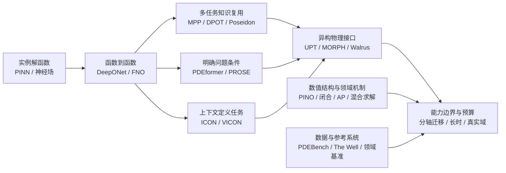

# 从 AI 求解 PDE 到可迁移物理基座：研究总结与知识图谱

**证据截止：2026-09-19；仓库快照：`428741f55fe2301ea7ca3029fedc3e913b07b2cc`。**

本次研究的主要判断是：这个领域正在把研究对象从“拟合一种方程的解”推进到“复用多种物理任务的表示、条件与求解经验”。但统一架构、混合训练、连续查询和少样本结果，分别只支持通用性的某个侧面。最值得学习的创新思路，是找出信息在哪一层丢失、知识通过什么接口复用，以及用什么实验排除更简单的解释。

仓库的两条历史主线——通用 AI-for-PDE 方法，以及等离子体、辐射输运、EUV 等领域应用——并不是割裂的。前者探索复用范围，后者暴露物理状态、闭合、尺度极限和实际求解成本的约束。把两者连接起来，比单纯罗列新的 Transformer、Mamba 或 MoE 更有研究价值。

## 导读与产物

- [交互知识图谱与阅读工作台](index.html)：按主题、年份、证据层次检索论文，查看关联与原始来源。
- [架构与预训练专题](architecture_review.md)：代表模型的表征、条件化、训练目标、协议与局限。
- [数据、评测与泛化专题](evaluation_review.md)：基准、信息边界、最新五篇及能力验证矩阵。
- [领域方法专题](domain_review.md)：闭合、辐射、EUV、高维动理学与混合数值求解。
- [创新问题与区分实验](innovation_agenda.md)：八项可证伪假说及其失败判据。
- [全量论文卡片](ALL_PAPERS.md)、[语料审计](corpus_audit.md)：454 条身份的覆盖、来源、空缺与主题归类。
- [机器图谱](knowledge_graph.json)、[原文证据账本](primary_evidence.json)、[语义关系图](semantic_graph.json)：用于后续查询和增量维护。

## 1. 覆盖了什么，以及证据能支持到哪里

本地 `main` 从 `ce785f1` 快进至 `428741f`，与本次 fetch 得到的 `origin/main` 相同，新增6次提交。全量结构化分析覆盖 **454 条主表身份、1,016 条来源记录和 144 份本地 Markdown 档案**。身份数不等于已证实的独立研究数：仍有题名近似重复、仅 DOI、未解析身份，以及里程碑表与主表尚未对齐的问题。

远程 9 月 16 日分支含一份未进入 main 的日报，核心入选为0；已保留其[原始字节快照](remote_20260916_digest.txt)和[提交与哈希记录](remote_sync.json)。分支附录候选不计入454登记身份，也不自动合并进现行注册表。

| 层次 | 本次实际工作 | 能支持什么 |
|---|---|---|
| 全量本地整理 | 扫描主表、全部来源、现有报告与里程碑；生成一对一卡片和可追溯标签 | 了解已收集范围、主题关系、元数据缺口；不能证明所有摘要准确 |
| 重点原文核查 | 42个工作标识（35个主表身份、7个背景标识），43条专题记录；41项读到正文相关章节，1项为摘要加官方文档 | 支持对应论文的机制与适用范围；不等于逐页读完所有证明和附录 |
| 综合分析 | 比较信息接口、任务分布、适配资源、失效机制；构造研究问题 | 是本综述的归纳或假说，图中显式区分，不能冒充作者的因果结论 |
| 运行复验 | 本次没有运行论文模型或科学实验 | 不提供独立性能排名或复现成功声明 |

主表的历史阅读状态有449条为空、5条为摘要核查；444条仍标为 `legacy_unverified`，5条为 `conflict_pending`，5条为 `source_checked`。这与本次另存的重点原文阅读账本是两套记录。我们保留历史状态，不用新的概括覆盖旧证据，也不把原文作者的实验结果升级为独立复验。

主表有344条方法/贡献描述、122条摘要，3条无题名。它足以组织全面的研究索引，但不足以对454条逐项确认训练集、模型规模和泛化协议。缺失处在卡片中保持未知。详细计数、输入哈希和重复候选见语料审计。

## 2. 用一个统一问题框架理解不同路线

对于参数 \(\mu\)、区域 \(\Omega\)、初值 \(u_0\)、边界 \(b\)、外源 \(f\)，可将目标解写成

\[
u=\mathcal S(\mathcal P,\mu,\Omega,u_0,b,f),
\]

其中 \(\mathcal P\) 表示方程结构。学习系统接收的通常不是连续问题本身，而是经采样、编码、条件化后的有限信息：

\[
\hat u(Q)=D_Q\circ F_\theta\big(E(Su_{\mathrm{obs}}),C(\mathcal P,\mu,\Omega,b),\mathcal D_{ctx}\big).
\]

这是本综述的分析框架，不是所有论文共享的实现。\(S\) 是观测或离散化，\(E\) 是编码，\(C\) 是问题条件，\(F\) 是计算主干，\(D_Q\) 是查询点解码，\(\mathcal D_{ctx}\) 是上下文示例。不同创新主要改变这里的不同接口。

| 路线 | 学习对象 | 参数通常何时更新 | 最关键的适用边界 |
|---|---|---|---|
| 实例 PINN / 神经场 | 一道给定 PDE 问题的解函数 | 求解该实例时 | 优化难度、残差尺度、初边值与适定性 |
| 单族神经算子 | 一类参数化问题的解映射 | 离线训练；可另做目标微调 | 训练分布内变化与真正外推须分开 |
| 多物理预训练模型 | 多任务共享表示与演化规律 | 预训练后按协议微调/适配 | 所谓跨物理是否留出了目标 PDE，是否更换头部 |
| 上下文算子 | 条件于示例的函数映射 | 测试时可不改权重 | 示例来源、是否含目标标签、上下文成本 |
| 概率 / 生成式求解 | 条件解分布或部分观测后的后验 | 训练后需采样/引导/校正 | 噪声来源、不唯一性、校准与采样成本 |
| 混合数值—学习 | 闭合、预条件器、修正或物性模块 | 可离线学习再嵌入求解 | 模块误差如何反馈为闭环误差 |

学习这些工作时，每次先问：**它预测的究竟是场、算子、分布、参数，还是数值算法的一个部件？** 对象不同，评价和可复用性也不同。

## 3. 发展脉络：六个逐渐扩展的问题

下图为概念演进，箭头表示本综述识别的“问题扩展”，不是已核验的文献引用。它也不是严格按年份互相取代的线性历史；多条路线一直并行发展。



### 3.1 从逐实例解，到可摊销的算子

DeepONet 和 FNO 是理解算子学习的基础入口：研究对象从某个固定解扩展为输入函数到输出函数的映射。核心收益是多次查询时摊销离线训练成本。两者在里程碑表中，但没有按相同 arXiv 身份进入当前主表，图中将它们保留为补充参考，不能暗计为454条已入库论文。

关键问题随之改变：模型是否只对采样分布有效？离散网格改变时，数值表达是否保持一致？前向快速是否值得高昂训练和数据生成成本？详细机制与原文定位见[架构专题](architecture_review.md)。

### 3.2 从同一任务族，到共享预训练

MPP、DPOT、Poseidon 的代表性不在于都使用“大网络”，而在于把多种动力学训练信息作为可迁移资源。训练任务怎样生成、数据怎样混合、预测时间怎样条件化，决定了模型学习到什么共享结构。仅让一个网络同时适配多个数据集，不足以得出对未见方程的泛化结论。

此阶段真正的比较对象应包括同架构从零训练、相同目标样本数、相同微调预算与源任务留出。未经这些控制的“样本效率”不能单独归因于预训练。论文级训练与评测差异见架构专题，而不是用各文报告的误差做跨榜单排名。

### 3.3 任务怎么告诉模型：符号、参数还是示例？

PDEformer/PROSE 把方程结构纳入条件；ICON/VICON 用示例建立待求算子的上下文。这两条线的共同贡献，是让“问题是什么”成为模型接口的一部分。其分歧是需要怎样的目标信息：符号可能不包含未知闭合，示例可能包含额外监督与推断开销。

据此可提出新的实验：保持总输入预算，比较符号与上下文的独立和组合效果，并打乱条件检查模型是否真正使用它们。此处是研究假说，不能仅从两篇方法名字推导出组合必有增益。

### 3.4 真正异构的变量、维度、几何与离散化

UPT、MORPH、Walrus 等尝试在输入输出结构不同的任务间组织共享计算；PDE-FM 等探索主干效率。这里必须区分三件事：支持多种输入形状、在多数据集上联合训练、对未见物理问题迁移。这三件事的证据互不替代。

例如，本次核查 PDE-FM 正文发现其多数据集预训练使用数据集专用的1×1输入/输出适配器；在参与联合训练的 The Well 数据集测试划分上得到结果，不自动构成留出 PDE 的迁移实验。这个事实应改变我们对“统一”的理解：先描述共享与专用部分，再评价复用范围。[PDE-FM 原文](https://arxiv.org/html/2511.21861v1)

### 3.5 从能预测，到预测多久、为何可信

一步误差、长时轨迹、混沌统计、守恒与最终任务量是不同目标。稳定化可能来自更合适的训练、结构约束，也可能只是过度平滑；这需要能谱、事件、统计和失败率共同鉴别。最新 VAMO 给出有条件的潜动力学误差分析，但不能据标题宣称任意长期稳定。[VAMO 方法与理论](https://arxiv.org/html/2609.16621v1)

另一方面，生成模型适用于随机动力学或不完整观测下的分布建模，不能仅因为输出样本“像真实场”就认为方程被正确求解。其评测要同时考虑条件信息、严格评分规则、物理可行性和采样代价。

### 3.6 数据与评测成为独立的科学问题

PDEBench、The Well 提供可比较与可扩展的数据接口；SPDEBench 要求认真处理随机参考解；REALM 暴露应用复杂性；RealPDEBench 则检查模拟与测量之间的距离。它们不是“更大的数据集”这一条轴上的简单升级。

最终，研究问题应转为：哪一类数据变化损害了哪一种能力？目标侧增加了什么信息？模型改善是否超过了表示或参考解的误差下限？[评测专题](evaluation_review.md)把这些问题整理为可直接用于读论文和设计实验的矩阵。

## 4. 本次阅读改变了哪些判断

| 原有表述或常见读法 | 原文支持的更精确判断 | 对研究的影响 |
|---|---|---|
| “跨数据集”即未见 PDE 泛化 | 联合训练内测试、留出参数、留出家族必须分别标注 | 建立训练/评测 PDE 的显式集合和 overlap |
| PDE-FM 无需数据集专用修改 | 共享主干同时存在专用输入/输出适配器 | 评估部署新任务时究竟新增什么 |
| 某模型表中胜过 Poseidon，即全面优于原模型 | Walrus 的比较对 Poseidon 下游采用特定固定步长自回归适配协议 | 结论仅对实际对齐的协议成立 |
| “预训练收益反转”即负迁移 | 2609.20814 的两个目标数据效率排序反转；列出的四个比值仍都大于1 | 负迁移、收益衰减、目标间排序变化分开 |
| 连续输出接口意味着可恢复任意高频 | 超分辨率需要输出正则性、覆盖或额外物理信息 | 增加插值/混叠对照，公开细网格监督 |
| 闭合拟合好就能稳定模拟 | 热流闭合论文将耦合求解器验证留作后续 | 做闭环验证后才能谈稳定加速 |
| PhIT 已验证完整 ICF 动力学改善 | 核查到的核心实验是变换与 PCA 误差分析 | 表示改进与最终物理解算收益分开 |
| realistic 数据就是真实测量 | REALM 为高保真应用模拟；RealPDEBench 含实验测量配对 | 不混淆数值复杂性与 sim-to-real 证据 |

逐项外部来源与章节见三个专题及证据账本。这些是综述中的解释修正；当前主表、历史日报和原始评分均未被本次直接改写。后续若要修正主表，应通过有来源的事件保留变更历史。

## 5. 如何读知识图谱

图谱有两层，目的不同。

**全量检索层**覆盖454条主表身份、里程碑补充参考、主题和本地来源。论文—主题边来自公开规则对题名、摘要和历史描述的匹配，保留命中字段与文本。它帮助寻找“哪些工作可能相关”，不证明这些工作真的完成了某项能力，也不是引文网络。相似题名只列待核验候选，不能自动合并。

**证据与研究层**从重点阅读账本构造论文—机制—主张—局限关系，并把概念演进与八项研究问题单独标为综合分析。全量检索层有658节点、3610边，证据与研究层有271节点、228边；两层分别导出，不能相加作为不重复实体总数。每项结论都可回到原始URL、版本和阅读位置。`reviewed_source_summary` 表示有原文依据的综述概括，可能含阅读者解释，不能默认全是作者直接主张；局限解释与未经验证的研究假说另作标记。本次没有给任何论文添加“独立复现成功”标签。

页面支持先按主题筛选，再点论文查看历史卡片和本次阅读结论。网络视图采用有限分页避免过密，完整身份始终可在目录检索。时间轴中 arXiv 编号年月只表示推断的提交月份；正式发表日期、首次被仓库发现的日期分别保存，不能混用来判断谁先提出一种想法。

### 三个实际查询例子

1. **想研究跨几何表示**：检索 geometry / 几何，先区分点云算子、潜表示、几何预训练和自适应网格交互；再看目标是否为新形状、新拓扑还是仅重采样。
2. **想研究预训练收益**：找到 MPP/DPOT/Poseidon 与2609.20814，比较源数据、目标信息和预算；不能把各自报告的倍数放在一列直接排名。
3. **想把基座用于等离子体**：检索 plasma / closure / kinetic，先确定预测对象是完整分布函数、矩、闭合还是观测量，再检查是否需要高维信息和闭环数值接口。

## 6. 创新思路的共性，以及最有区分力的下一步

本次梳理得到四种反复出现的创新模式。

**改变学习单位。** 从一个解变成算子，从算子变成上下文定义的任务，从完整状态变成可组合模块。创新的价值取决于新增的复用范围，而不是名字是否更通用。

**让结构进入信息接口。** 方程图、几何、物理量、无量纲尺度、不同维度的耦合都可约束模型。好的结构应对应可验证的失效机制，例如混叠、量纲失配、信息丢失或错误的极限行为。

**重新分配昂贵计算。** 稀疏专家、潜空间演化、预条件、响应子空间或混合求解，都是把成本放到更有用的位置。应比较给定精度的总成本，尤其计入数据生成、预训练、缓存和在线适配。

**用反例收紧能力主张。** 负结果、信息论限制、真实域测试和受控偏移并非附属工作；它们决定架构改进是否解决了真实问题。对研究设计最有用的不是最多的数据集，而是能区分两种机制解释的实验。

据此，优先问题是：跨采样一致性是否能预测迁移、哪些源任务真正提供正迁移、长时稳定是否以牺牲物理统计为代价，以及残差能否可靠指导额外求解预算。八项问题的公式、对照与失败标准见[创新议程](innovation_agenda.md)。这些是待检验方向，未宣称已经完成新颖性证明或实验验证。

## 7. 一条循序渐进的学习路径

| 阶段 | 读什么 | 应能回答的问题 | 学习产出 |
|---|---|---|---|
| 1. 明确学习对象 | DeepONet、FNO、PINO | 解函数、算子和实例适配有什么区别？ | 写清输入/输出、训练与测试资源 |
| 2. 理解共享训练 | MPP、DPOT、Poseidon | 什么知识被共享，目标任务是否真正留出？ | 对齐训练集、适配协议和预算 |
| 3. 比较条件与表示 | PDEformer、PROSE、ICON/VICON、UPT、MORPH | 方程、示例、几何各提供什么信息？ | 画输入信息流，列不可辨识情况 |
| 4. 学会质疑基准 | PDEBench、The Well、SPDEBench、REALM、RealPDEBench | 标签是什么，误差分母是什么，哪一轴变化？ | 给每项能力写完整条件元组 |
| 5. 理解闭环物理 | 热流闭合、APNN、PhIT、NeuralGCM、GyroSwin、WGNO | 模块误差怎样影响实际物理结果？ | 区分离线拟合、系统稳定和任务收益 |
| 6. 设计自己的问题 | 最新五篇、创新议程 | 最便宜的哪个实验可以否定当前想法？ | 一个有基线、反例和停止条件的研究设计 |

学习顺序是本综述建议，不代表论文影响力或性能排名。数学证明、复杂实验和代码运行仍需要分别投入；阅读一段摘要不能替代这些工作。

## 8. 维护和复用

本次产物是固定快照。离线构建脚本分别负责全量图谱和阅读页面，证据 JSON 保存本次人工核查结果。输入变化后应重新构建并检查；不会通过打开页面自动访问外网或篡改注册表。

```bash
python scripts/build_research_graph.py
python scripts/build_research_site.py
python scripts/build_research_graph.py --check
python scripts/build_research_site.py --check
python scripts/papertrack.py check
```

后续维护建议以“新增一条证据改变了哪项判断”为单位：先核对论文身份与版本，再记录主张、实验条件和局限，最后决定是否改变关系边。正式发表状态和评分继续沿用原仓库的事件机制。本地总结和图谱已经形成独立产物；远程发布与科学实验仍是另外的操作。
