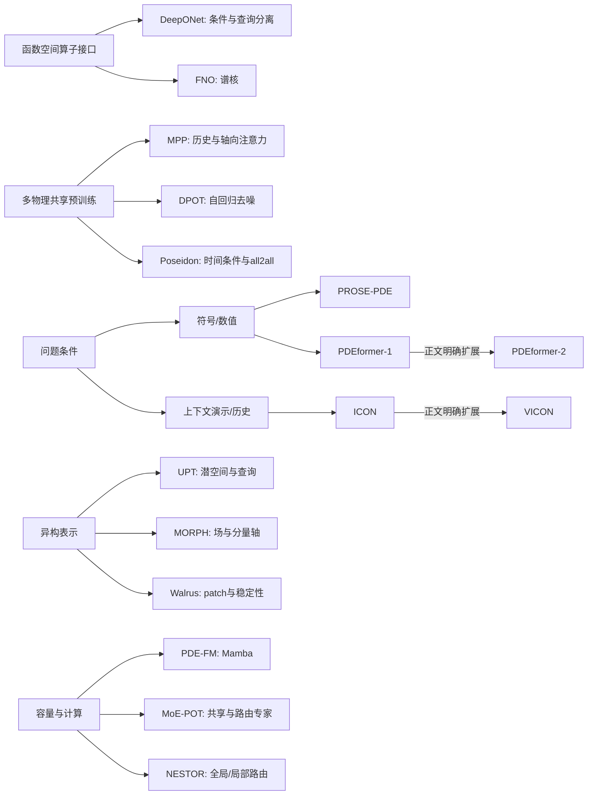

# PDE 基座架构与预训练：从算子表示到跨物理适配

> 2026-10-02 版本说明：以下原有 18 项正文核查沿用 2026-09-19 的记录和阅读范围；本轮未重读它们。新增机制判断见本章末尾以及[研究更新](research_update.md)。

> 核验日期：2026-09-19。仓库基线：`428741f55fe2301ea7ca3029fedc3e913b07b2cc`。本章针对 18 篇代表性论文核对原始方法、评测及相关局限章节，其中 12 篇在当前注册表，6 篇仅作背景。这里的“正文核对”不是逐页通读，也不是代码或实验复现。逐篇范围、版本、链接、支持性结论和局限见 [architecture_evidence.json](architecture_evidence.json)。

本章的主要判断是：PDE 基座模型的进展并不是一条“FNO 被 Transformer 替代、再被 Mamba 或 MoE 替代”的单线。更准确的脉络是，研究者同时解决四类瓶颈：如何让异构物理场进入共享表示；如何让模型知道它正在求解哪一个问题；如何从昂贵轨迹中提取可迁移知识；如何让这种知识在新的离散、时间尺度与物理场景中可靠使用。不同论文往往只推进其中一两项，名称中的 universal/foundation 不能代替完整验证。

## 1. 范围与身份边界

本章的 **corpus** 论文为 DPOT、Poseidon、PROSE-PDE、PDEformer-2、Walrus、MORPH、PDE-FM、VICON、MoE-POT、NESTOR、GPhyT、OmniArch。**background** 为 DeepONet、FNO、MPP、PDEformer-1、UPT、ICON：这些名称虽见于 `LANDMARK_MODELS.md`，其对应 arXiv 身份不在本次 `metadata/papers.jsonl` 中，不能混入已收录论文统计。

核验覆盖各文的方法及关键实验章节，未核验所有数学证明、所有附录表格、仓库实现、训练数据字节身份及可重复性。本章涉及的 18 个 ID 与取得的原始论文标题相符；这不等于已审计整份 LANDMARK。特别保留以下证据边界：

- **版本不同会改变定位与结论。** PDEformer-2 使用 2026-09-14 的 v3；MORPH 的 HF 转换最初返回 v3，随后回查官方 v4；Walrus 先取 HF 转换，随后用官方 v2 PDF 核验，最终以 v2 为准。
- **ICON 不是已核验的期刊最终文本。** arXiv v3 页首自称旧预印本并指向 PNAS；本章使用这一预印本的方法与实验，未声称读过 PNAS 最终版。[ICON v3](https://arxiv.org/html/2304.07993v3)
- **OmniArch 的“首个”不予沿用。** 当前 LANDMARK 含历史优先权表述，本次只核验方法与实验，未完成证明“首个”所需的同期全量文献检索。[OmniArch v3](https://arxiv.org/html/2402.16014v3)
- **PDE-FM 的摘要与正文需分开。** 摘要称无需数据特定修改，正文 `Multi-Dataset Pretraining` 明确使用每数据集的 `1×1` 输入、输出 adapter。其主表是 12 个预训练来源数据集的官方测试划分，没有据此建立“任意未见 PDE 免改架构零样本迁移”的结论。2026-08-21 日报的强表述应降为待独立协议验证；本章不修改历史日报和注册表。[PDE-FM v1](https://arxiv.org/html/2511.21861v1)

## 2. 建议采用的统一问题接口

为了防止把不同任务混成同一“求解能力”，可以用下列**本章综合接口**理解论文，而不把它冒充任何单篇论文的原始定义：

\[
\widehat u(y,t+\tau)=D_\theta\!\left(A_\theta\!\left(E_\theta(\mathcal O),\,c,\,\tau,\,\mathcal C\right),y\right).
\]

这里，\(\mathcal O\) 是观测场及其坐标/网格/时间；\(c\) 包含方程、参数、边界、几何及单位信息；\(\mathcal C\) 是可选的上下文输入—输出演示；\(y\) 是输出查询点。并非所有方法都显式提供这些量：隐藏的信息可能被假定固定，也可能必须从历史轨迹估计。由此有四种不同能力，必须分别记账。

| 能力 | 改变的是什么 | 合格证据 | 容易混淆的替代证据 |
|---|---|---|---|
| 算子实例泛化 | 初值、系数取值、某类几何参数 | 固定问题族的独立实例测试 | 训练误差低 |
| 离散与表征泛化 | 分辨率、采样点、字段数、维数 | 物理问题可比且输入/输出接口明确 | 插值后回到训练网格 |
| 问题识别与跨方程泛化 | 方程形式、驱动、边界机制 | 明确留出方程，条件或上下文足够 | 联合训练族内test被称为zero-shot |
| 适配效率 | 下游标签/更新/上下文预算 | 同数据、优化与算力预算的学习曲线 | 一个模型微调、另一个从零训练但预算不报 |

“坐标连续输出”与“任意输入离散”是不同接口；“同一架构可训练多种 PDE”与“同一权重可跨 PDE 使用”也必须分开。对无法由输入唯一确定未来的系统，再强的 backbone 也无法从有限信息恢复唯一解，这是后文架构选择的共同约束。

## 3. 五条相互交叉的发展脉络

### 3.1 从函数到函数：连续输出与谱域计算的两种基础接口

DeepONet 把函数条件与查询坐标分开，以分支向量和主干向量的内积输出函数值；FNO 则在 Fourier 域参数化核，把全局空间混合转成频率操作。二者的共同贡献是把学习对象从固定维向量映射推进到算子；其原始实验本身没有证明一个统一多物理预训练模型。[DeepONet，§2.1/§3](https://arxiv.org/abs/1910.03193)；[FNO，§3–5](https://arxiv.org/abs/2010.08895)

\[
\text{DeepONet:}\quad \widehat{\mathcal G(a)}(y)=\sum_{k=1}^{p}b_k(a(x_1),\ldots,a(x_m))\,t_k(y)+b_0,
\]
\[
\text{FNO 层的简化形式:}\quad v_{\ell+1}=\sigma\!\left(W_\ell v_\ell+\mathcal F^{-1}(R_\ell\mathcal Fv_\ell)\right).
\]

第一式说明输入函数压缩与输出位置可分离；第二式说明全局混合可以用结构化算子降低成本。前者启发“条件潜码＋坐标解码”的接口，后者启发谱 token 与频域混合；这里的“启发”是方法类比，不能自动生成论文之间的引用继承边。

### 3.2 从专用算子到共享表征：多物理预训练

MPP 首先直接检验“不同物理能否共享表示并使适配受益”，采用字段嵌入、可逆归一化与轴向时空注意力。DPOT 在历史预测上加入输入去噪，用 Fourier mixer 扩展容量并统一数据形状。Poseidon 则强调初值到任意 lead time 的时间条件算子，并以 all2all 重用轨迹中的起终点对。三者的差异既是架构差异，也是**允许观察多少历史、时间如何输入、如何构成训练样本**的差异。[MPP，§4–5](https://arxiv.org/html/2310.02994v2)；[DPOT，§3–4](https://arxiv.org/html/2403.03542v4)；[Poseidon，§2–3](https://arxiv.org/html/2405.19101v2)

OmniArch 把不同空间维数的数据压成谱域序列，再共享时间 Transformer，并在适配阶段引入 PDE-Aligner。它表明，“共享主干”可以与“分维度输入输出模块”共存，不能只按是否使用一个模型名称判断接口统一程度。[OmniArch，§3](https://arxiv.org/html/2402.16014v3)

**综合判断：** 这一阶段最可靠的创新对象是“预训练数据与下游学习效率的关系”，并非自动消除了所有问题特定输入、输出和适配机制。

### 3.3 从隐式推断物理到明确指定问题：符号条件与上下文两条支线

PROSE-PDE 将数值轨迹和符号表达分别编码，并能同时输出未来数值与方程；PDEformer 将方程直接编译成计算图，再用图 Transformer 调制坐标 INR。PDEformer-2 扩展到二维域、边界和多变量，并用 SDF 表示几何。它们让“模型究竟知道哪些物理条件”成为可检查的输入接口。[PROSE-PDE，§3.2/§4.2/§5](https://arxiv.org/html/2404.12355v3)；[PDEformer，§2–3](https://arxiv.org/html/2402.12652v3)；[PDEformer-2 v3](https://arxiv.org/html/2507.15409v3)

ICON 采取另一种方式：由少量输入—输出演示指定算子，再回答新输入，无需推理时更新权重。VICON 将演示中的逐点 token 改为 patch，以块因果注意力和时间 stride 增强处理稠密流体场。GPhyT 则从历史及有限差分特征估计时间导数，使用数值积分器推进，利用上下文适配新条件。[ICON，§3–4](https://arxiv.org/html/2304.07993v3)；[VICON，§4–5](https://arxiv.org/html/2411.16063v5)；[GPhyT，§3–4](https://arxiv.org/html/2509.13805v2)

**综合判断：** 显式方程条件与上下文不是简单的二选一。前者依赖已知且可编码的模型；后者承担从观测识别动力学的成本。部分已知物理与部分可观测数据的融合，是它们之间尚需独立实验验证的结合点。

### 3.4 从固定形状到异构场：表示接口成为主问题

UPT 用 supernode、perceiver 和固定数量潜 token 将输入离散与潜空间动力学分开，并用查询解码器恢复输出。MORPH 用统一的场/分量/空间轴布局、字段交叉注意力和轴向注意力吸收 1D–3D 异构张量。Walrus 面向原生分辨率与 2D/3D 异构训练，将自适应 patch、归一化、负载均衡和稳定化共同设计。[UPT，§3/附录A](https://arxiv.org/html/2402.12365v5)；[MORPH，§3–4](https://arxiv.org/html/2509.21670v4)；[Walrus，§3–5](https://arxiv.org/pdf/2511.15684v2)

这条线提示一个经常被低估的事实：tokenizer 不只是读文件的前处理。它决定哪些尺度、局部结构与字段耦合可以进入主干，以及主干误差会以什么空间形式回到物理场。因而需要将表示重构误差、动态预测误差与长期结构误差分别测量。

### 3.5 从稠密共享到选择性容量：Mamba 与 MoE 的不同动机

PDE-FM 用空间/谱融合和 Mamba 追求长序列处理；MoE-POT 以共享专家和稀疏路由专家分配共性与特化容量；NESTOR 再把路由分为全局样本与局部 token 两级。前者主要改变序列混合方式，后两者主要改变参数参与计算的方式，并不天然替代条件设计、数据配比和预训练目标。[PDE-FM](https://arxiv.org/html/2511.21861v1)；[MoE-POT，§3–5](https://arxiv.org/html/2510.25803v2)；[NESTOR，§4–5](https://arxiv.org/html/2602.22059v1)

**综合判断：** 路由与方程类别相关，最多是“模型使用了能区分数据来源的特征”的证据。若要称为可组合的物理专家，需要改变网格、单位、归一化、初值纹理后仍保持物理上可解释的路由，并检验新项组合时的功能迁移。

## 4. 逐篇技术对照：保留输入和评测协议

下表不是排行榜；“结论”均为原论文设定下的结果，未由本项目复现。各行详细来源定位在随附 JSON。

| 工作 / 收录范围 | 表征、条件及训练目标 | 泛化证据及边界 |
|---|---|---|
| DeepONet / background | 固定传感器分支＋查询坐标主干；监督算子拟合 | 输入函数分布/传感器数研究；输出连续不表示输入任意采样。 |
| FNO / background | 截断谱核＋局部分支；初值/系数字段监督 | 实例与分辨率；zero-shot super-resolution 不是未见 PDE。 |
| MPP / background | 字段嵌入、RevIN、AViT；历史一步预测 | 共享预训练与少样本收益；3D含权重膨胀和微调。 |
| DPOT / corpus | patch＋时间聚合＋Fourier mixer；带噪历史预测干净下一帧 | 预训练内测试及多种下游微调；统一网格和mask改变输入条件。 |
| Poseidon / corpus | 多尺度scOT、lead-time条件；all2all监督 | 15项适配任务，9项含预训练未见PDE；不能概括为全零样本。 |
| OmniArch / corpus | 分维度谱编码、共享时间Transformer；适配时PDE对齐 | 跨维度与适配研究；多个编码器仍是架构的一部分。 |
| PROSE-PDE / corpus | 数据/符号双编码和双输出；数值误差＋符号学习 | 一维常系数PDE的外推；符号可解析不等于唯一发现真方程。 |
| PDEformer-1 / background | PDE-DAG＋Graphormer＋INR；符号/数值共同条件 | 500k随机方程预训练；“域内外”主要按系数范围定义。 |
| PDEformer-2 / corpus | 二维函数编码、SDF几何/边界、图条件INR | 40TB、8种通用模板；相似问题零样本与新PDE适配分开。 |
| UPT / background | 点/网格/粒子→固定latent→查询输出；逆编解码辅助损失 | 统一架构和潜rollout；不是已证跨任意物理统一权重。 |
| Walrus / corpus | 时空分解、可变patch、增量归一化、patch jitter | 19场景与2D/3D适配；基线配置经修改，混沌长时需统计指标。 |
| MORPH / corpus | UPTF-7、分量卷积、场交叉注意力、四轴注意力 | 6集预训练、7集适配；另有冻结模态迁移，GCR基线须保留。 |
| PDE-FM / corpus | 空间谱token、FiLM、Mamba、Fourier头、数据集adapter | 12个来源数据集test；留一方程迁移未在已读正文中定位。 |
| ICON / background | 示例对＋新查询，点级token；不更新权重 | ODE/PDE/控制19类；示例有获得成本，高维点级token贵。 |
| VICON / corpus | patch示例对＋块因果mask；prompt归一化和随机stride | 3个二维流体集，10帧上下文；缺帧不等于真实传感器验证。 |
| GPhyT / corpus | 场/差分特征→时间导数→Euler推进；历史上下文 | 新边界/新流体现象；二维、有限物理覆盖，长期仍不及数值精度。 |
| MoE-POT / corpus | 每层16选4路由＋2共享专家；去噪与负载均衡 | 6集test的zero-shot与3项500epoch适配分开；激活数≠实测吞吐。 |
| NESTOR / corpus | 图像级MoE＋token级Sub-MoE；两级负载均衡 | 12集及512²湍流适配；200/500epoch结果不叫无更新迁移。 |

## 5. 可加入知识图谱的关系，以及不应加入的关系

关系类型至少应包含 `uses_mechanism`、`addresses_limitation`、`evaluated_under`、`explicit_extension`、`methodological_analogy`。只有正文明确说明延续或采用时，才使用 `explicit_extension`；“时间在后”或“同一团队”不足以构成继承。

图中大部分箭头是“属于某方法问题”而非论文引用关系。进一步可建立以下跨线连接，但其语义应保存为**综合类比或待验证组合**：

| 连接 | 可迁移的思想 | 不能据此推出 |
|---|---|---|
| DeepONet ↔ PDEformer/UPT | 条件表示与输出查询解耦 | 三者输入信息、训练目标相同 |
| FNO ↔ DPOT/OmniArch/PDE-FM | 频域作为高效全局交互接口 | 频谱表示一定守恒或抗混叠 |
| MPP ↔ Walrus/MORPH | 字段语义、归一化和高维计算分解 | 所有工作使用同样字段身份与采样协议 |
| Poseidon ↔ VICON/GPhyT | 显式时间跨度或多stride训练 | 三者学习相同的连续时间生成元 |
| PDEformer ↔ ICON | 从明确公式或示例确定算子 | 无显式公式时系统必然可辨识 |
| MoE-POT ↔ NESTOR | 用稀疏专家协调共享与特化 | 路由专家天然对应对流/扩散等物理项 |

## 6. 从现有创新反推真正值得检验的问题

以下为本章提出的研究假设，不是已发表结果，也没有启动训练。它们将“换一个 backbone”的提案细化为可否证问题。

| 假设 | 最小有判别力的实验 | 失败意味着什么 |
|---|---|---|
| 部分符号＋历史优于纯符号或纯历史 | 在相同模型/预算下分别遮蔽系数、边界与驱动；对照公式、历史、融合三种输入 | 融合收益可能只是输入量增加，或当前分布没有条件歧义。 |
| 语义一致的tokenizer改善跨离散迁移 | 固定主干和训练轨迹，改变网格密度/采样测度/坐标尺度；分别测重构与预测 | 低重构误差不足以保证动力学信息保存。 |
| 多物理共享收益依赖数据的机制互补性 | 对流、扩散、耦合系统做固定总轨迹/算力的组合消融，目标方程严格留出 | 增益可能仅来自更多样本、尺度覆盖或优化稳定性。 |
| 稀疏路由能减轻真实物理负迁移 | 相同FLOPs/参数存储预算对照稠密模型；随机变换单位、网格与数据源标签 | 路由可能识别数据格式，未形成可复用的物理分工。 |
| 抗patch伪影能改善长期动态而非只改善视觉 | 对比jitter、抗混叠过滤和相同算力控制；测频谱尖峰、守恒漂移和时间相关 | 收益可能只来自随机增强或不同有效分辨率。 |
| 潜空间推进需要动力学一致性约束 | 相同压缩率下比较仅重构、一步监督、多跨度一致性；测闭环与多步误差 | 编码器可能保留外观却丢掉决定演化的状态变量。 |

其中第三项受到 MPP 的组合实验启发；第五项受到 Walrus 的谐波分析启发；第六项把 UPT 的潜rollout与时间条件算子的思想联系起来。它们都需要新的控制实验，不能以原论文单独结果为组合方案背书。

一个有用的误差分解是把观测/表示误差、局部推进误差、解码误差和递推放大分开。若局部映射在所考虑区域满足 Lipschitz 常数 \(L\)，局部误差上界为 \(\delta\)，则有条件地写成

\[
e_{n+1}\le L e_n+\delta.
\]

这只是诊断关系，不是这些神经模型已获得稳定性保证：长rollout失败既可能来自 \(\delta\) 大，也可能来自误差进入不稳定方向或条件信息不足。对混沌系统，还必须从逐点轨迹误差转向不变量、谱、统计分布和相干结构等任务合适的指标。

## 7. 让下一轮比较具备科学判别力

1. **先固定任务定义。** 记录输入是初值还是多帧历史，是否有方程、边界、几何、参数、单位、外力以及真实上下文答案。提供10帧解与只提供初值不是相同求解预算。
2. **按轨迹/方程身份划分，再生成窗口。** all2all和多stride会放大样本对数，但不会增加独立轨迹数。相同轨迹不同窗口不能跨训练测试。
3. **拆开迁移轴。** 预训练族内新实例、参数外推、新几何、新离散、新变量/维数、新方程应形成独立评测，不用单一“zero-shot”标签覆盖。
4. **同时报适配和推理成本。** 更新参数数、标签轨迹数、上下文获取成本、优化步数、总/激活参数、显存、墙钟时间分别记录。MoE的激活数或Mamba的渐近复杂度不能代替测量。
5. **同物理时间比较rollout。** 时间stride、初始上下文长度、预测起点及评估窗口全部固定或明确披露；不能把更少递推步骤的结果当作纯模型精度优势。
6. **查明baseline是否被改造。** Walrus v2 附录 C.3.3 将 Poseidon 的条件时间固定并按自回归微调；C.3.4缩短MPP上下文。这些是该研究协议的一部分，解释结果必须保留。[Walrus v2，附录C.3](https://arxiv.org/pdf/2511.15684v2)
7. **区分数值真值与独立交叉检查。** PDEformer-2 v3包含部分教师求解器失败/伪影案例的交叉检查；这种证据有价值，但不代表所有预训练数据已被独立认证。[PDEformer-2 v3，Pretraining results](https://arxiv.org/html/2507.15409v3)

本章因此将研究阅读顺序建议为：先理解 DeepONet/FNO 的算子接口，再比较 MPP、DPOT、Poseidon 的任务定义；随后并行读符号条件与上下文路线；最后读 UPT、MORPH、Walrus 的异构与稳定性问题，再讨论 Mamba/MoE 的计算优势。这样可以先判断一个方法解决了什么问题，再判断其新模块是否值得引入。

## 2026-10-02 增量：学习目标、表示预算与互补空间

本轮新增三个架构问题。RD-JEPA 将未来预测目标放到潜空间，但四帧历史、预训练预算、预测器结构和解码器适配共同参与结果；整体通路有效不等于某一损失已被独立验证。MENO 将流形积分矩与点查询分离，提醒我们先测固定容量表示的信息损失，再决定共享主干规模。Beyond PINNs 用能量投影构造互补修正，提供把“专家互补”变成可测结构的思路。[RD-JEPA Methods](https://arxiv.org/html/2609.29403v1#Sx3)、[MENO §2–3](https://arxiv.org/html/2609.27739v1#S2)、[Beyond PINNs §4](https://arxiv.org/html/2609.20641v1#S4)

对本项目的分析是：编码、共享动态学习和专家协作应分别设置反证对照。预测潜目标可能丢掉细尺度；固定模态可能抹平耦合敏感信息；不具备同一能量形式的专家也不能直接套用正交投影。这些是待检验的转移条件，并非原论文已支持的 UPFM 组合能力。新增 5 项来源的完整阅读边界与建议见[研究更新](research_update.md)和[增量账本](incremental_evidence.json)。
